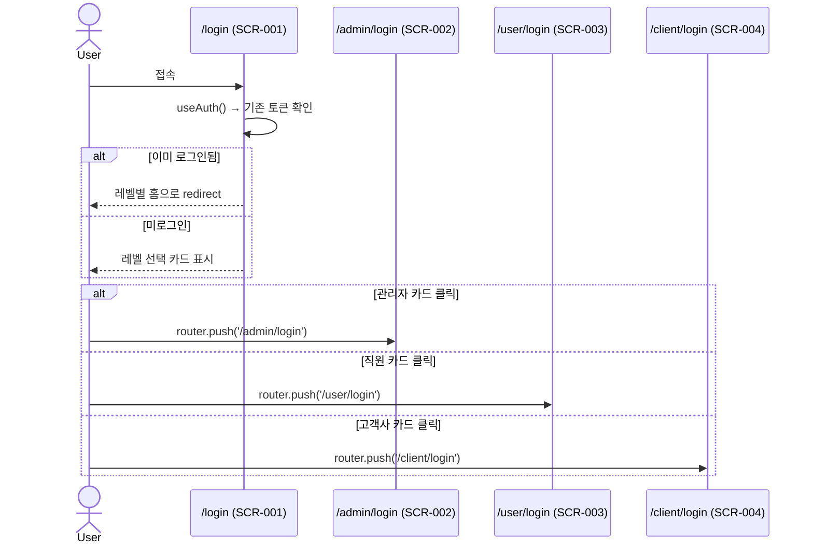
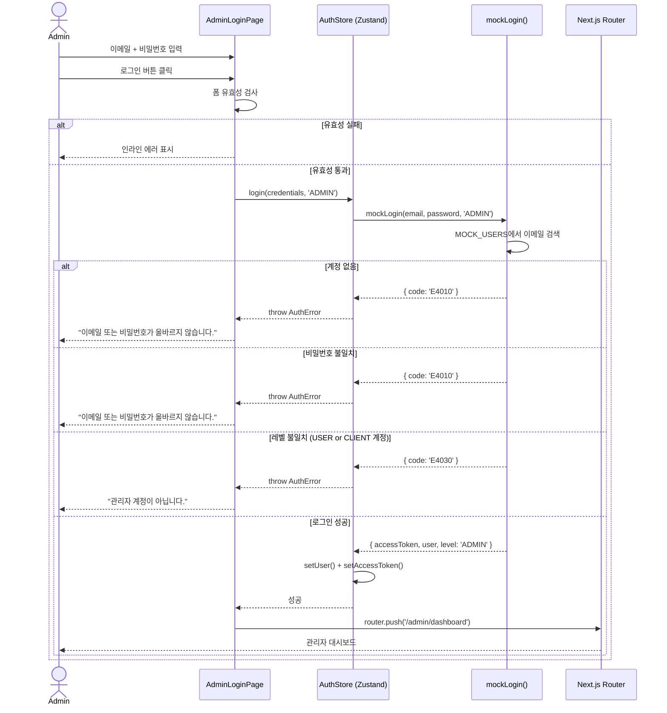
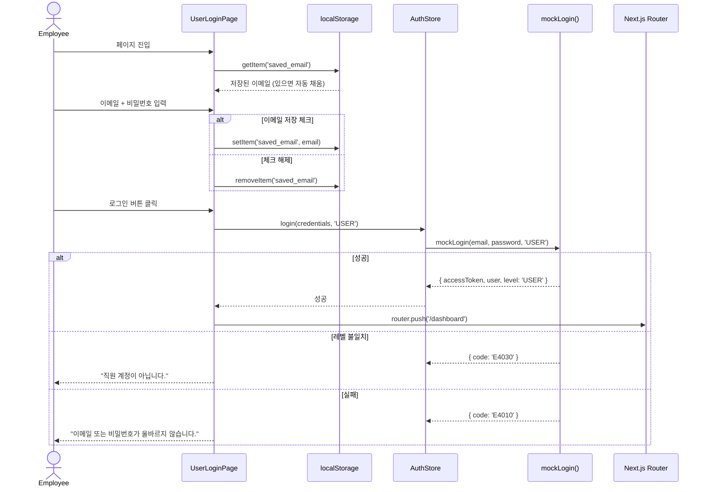
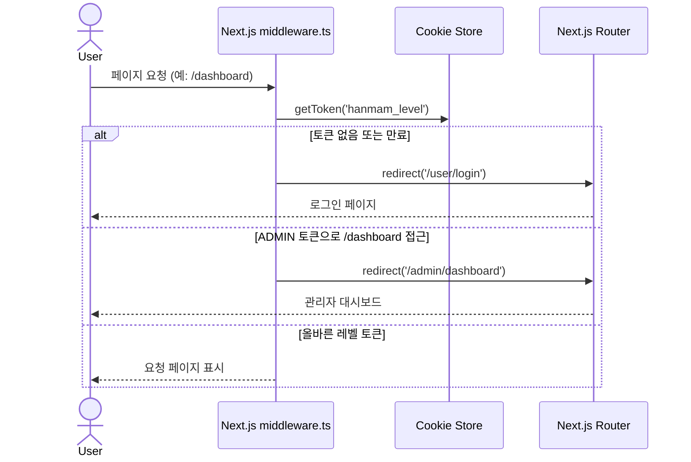
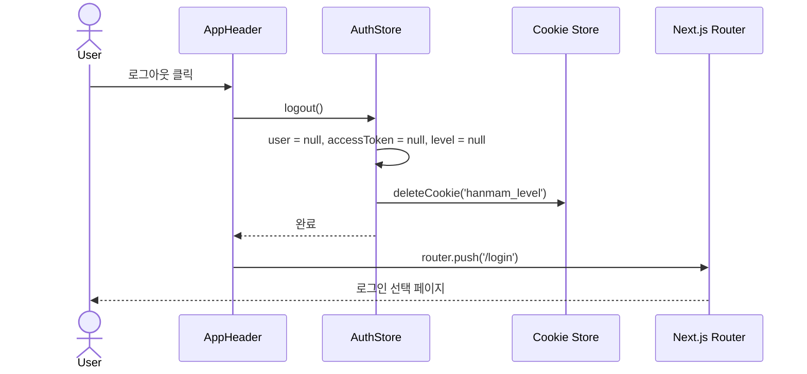

# SQD-auth-login

## 시퀀스 다이어그램 — 인증 시스템

| 항목 | 내용 |
|------|------|
| 문서번호 | SQD-auth-login |
| 작성일 | 2026-04-13 |
| 참조 | FRD-auth-login, REQ-260413-auth-login |

---

## 1. 로그인 분기 흐름

---

## 2. 관리자 로그인 흐름 (SCR-002)

---

## 3. 직원 로그인 흐름 (SCR-003)

---

## 4. Middleware 라우트 보호 흐름

---

## 5. 로그아웃 흐름

