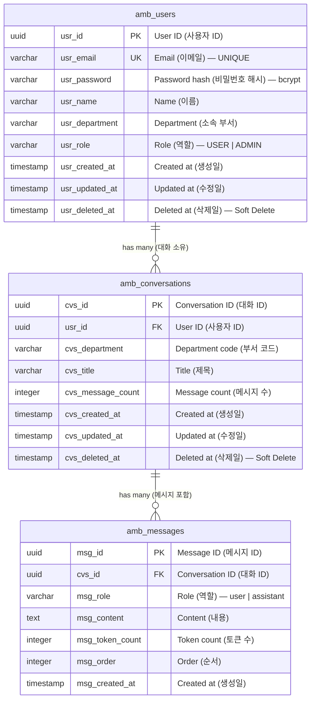

# Department AI Agent — ERD (부서별 AI 에이전트 ERD)

## ER Diagram (ER 다이어그램)

## Table Definitions (테이블 정의)

### amb_users (사용자)

| Column | Type | NULL | Default | Description |
|--------|------|------|---------|-------------|
| usr_id | UUID | NO | gen_random_uuid() | PK — User identifier (사용자 식별자) |
| usr_email | VARCHAR(200) | NO | — | UNIQUE — User email (이메일) |
| usr_password | VARCHAR(200) | NO | — | bcrypt hashed password (비밀번호 해시) |
| usr_name | VARCHAR(50) | NO | — | User display name (표시 이름) |
| usr_department | VARCHAR(30) | YES | NULL | User's department (소속 부서) |
| usr_role | VARCHAR(20) | NO | 'USER' | USER or ADMIN (역할) |
| usr_created_at | TIMESTAMP | NO | CURRENT_TIMESTAMP | Created timestamp (생성일시) |
| usr_updated_at | TIMESTAMP | NO | CURRENT_TIMESTAMP | Updated timestamp (수정일시) |
| usr_deleted_at | TIMESTAMP | YES | NULL | Soft delete marker (소프트 삭제 마커) |

**Indexes (인덱스)**:
- `PK: usr_id`
- `UNIQUE: usr_email` (WHERE usr_deleted_at IS NULL)

### amb_conversations (대화)

| Column | Type | NULL | Default | Description |
|--------|------|------|---------|-------------|
| cvs_id | UUID | NO | gen_random_uuid() | PK — Conversation identifier (대화 식별자) |
| usr_id | UUID | NO | — | FK → amb_users.usr_id (사용자 참조) |
| cvs_department | VARCHAR(30) | NO | — | Department code e.g. SALES, HR (부서 코드) |
| cvs_title | VARCHAR(200) | YES | NULL | Conversation title (대화 제목) |
| cvs_message_count | INTEGER | NO | 0 | Number of messages (메시지 수) |
| cvs_created_at | TIMESTAMP | NO | CURRENT_TIMESTAMP | Created timestamp (생성일시) |
| cvs_updated_at | TIMESTAMP | NO | CURRENT_TIMESTAMP | Updated timestamp (수정일시) |
| cvs_deleted_at | TIMESTAMP | YES | NULL | Soft delete marker (소프트 삭제 마커) |

**Indexes (인덱스)**:
- `PK: cvs_id`
- `FK: usr_id → amb_users(usr_id)`
- `IDX: (usr_id, cvs_department, cvs_deleted_at)` — For filtered listing

### amb_messages (메시지)

| Column | Type | NULL | Default | Description |
|--------|------|------|---------|-------------|
| msg_id | UUID | NO | gen_random_uuid() | PK — Message identifier (메시지 식별자) |
| cvs_id | UUID | NO | — | FK → amb_conversations.cvs_id (대화 참조) |
| msg_role | VARCHAR(20) | NO | — | 'user' or 'assistant' (역할) |
| msg_content | TEXT | NO | — | Message body (메시지 본문) |
| msg_token_count | INTEGER | YES | NULL | Token count for billing tracking (토큰 수) |
| msg_order | INTEGER | NO | — | Message order within conversation (대화 내 순서) |
| msg_created_at | TIMESTAMP | NO | CURRENT_TIMESTAMP | Created timestamp (생성일시) |

**Indexes (인덱스)**:
- `PK: msg_id`
- `FK: cvs_id → amb_conversations(cvs_id)`
- `IDX: (cvs_id, msg_order)` — For ordered message retrieval

## Migration Notes (마이그레이션 노트)

- Initial schema — No migration from existing tables required (초기 스키마 — 기존 테이블 마이그레이션 불필요)
- TypeORM `synchronize: true` used in development (개발 환경에서 TypeORM synchronize 사용)
- Production deployment will require TypeORM migrations (운영 배포 시 TypeORM 마이그레이션 필요)
- UUID generation: PostgreSQL `gen_random_uuid()` or TypeORM `uuid` strategy
