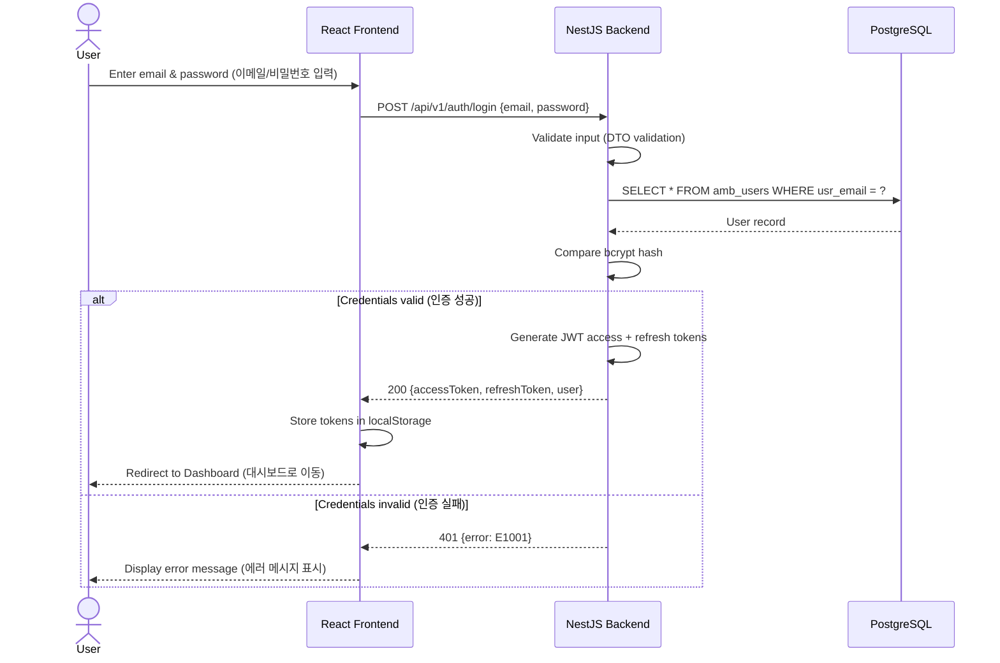
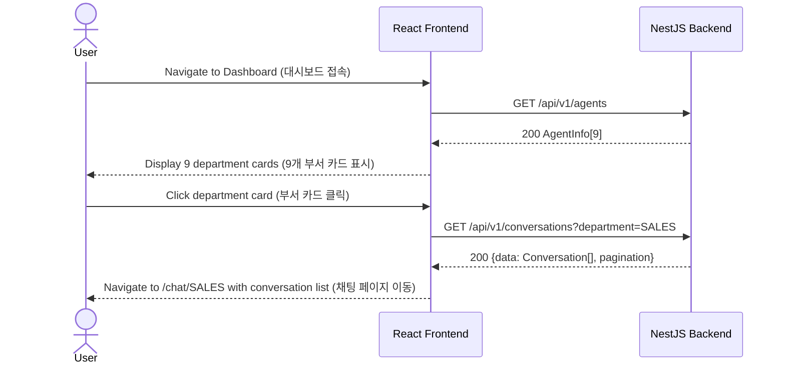
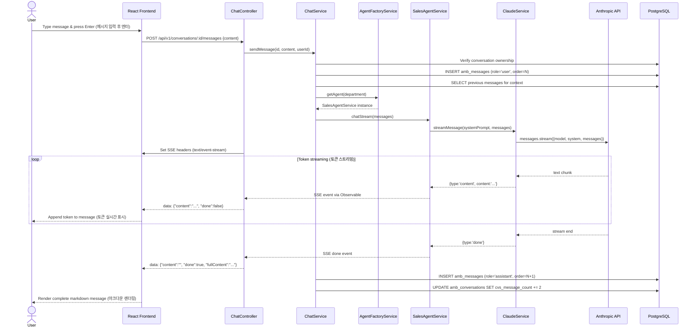
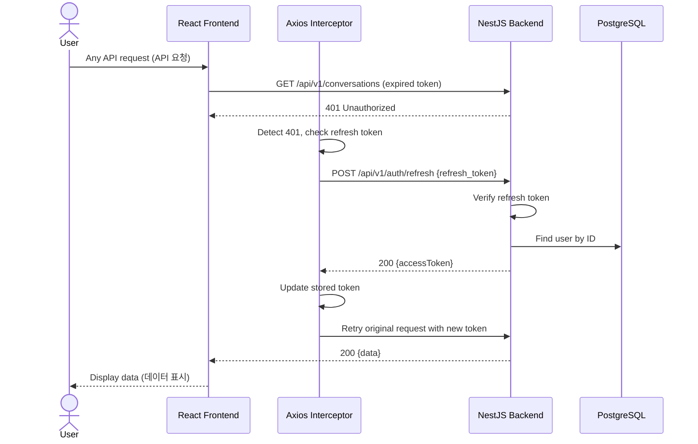
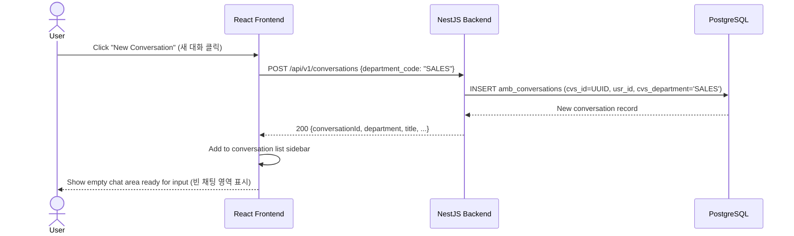

# Department AI Agent — Sequence Diagram (부서별 AI 에이전트 시퀀스 다이어그램)

## Scenario 1: User Login (사용자 로그인)

## Scenario 2: Department Agent Selection (부서 에이전트 선택)

## Scenario 3: SSE Streaming Chat (SSE 스트리밍 대화) — Core Flow

## Scenario 4: Token Refresh (토큰 갱신)

## Scenario 5: Create New Conversation (새 대화 생성)

