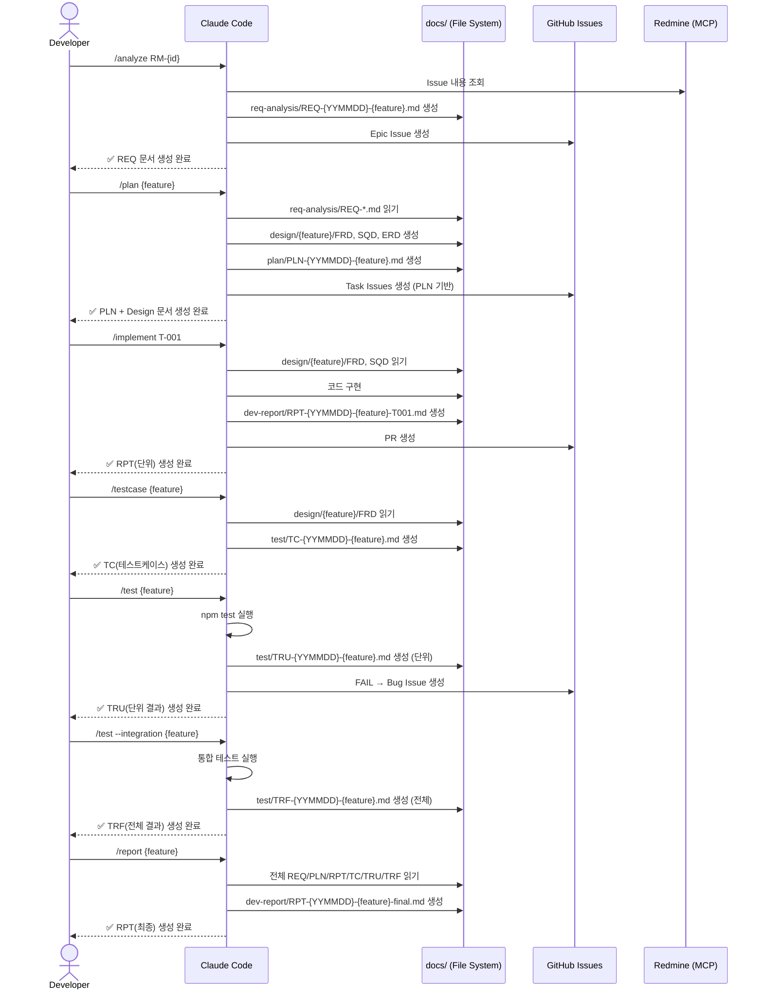

# Claude Code SDLC Harness — Implementation Plan
# 클로드코드 SDLC 하네스 시스템 구현계획서

---

## 1. Overview (개요)

- **Project**: Claude Code SDLC Harness for Amoeba Development Pipeline
- **Objective**: Amoeba 서비스(AmoebaTalk, AmoebaCampaign, AmoebaOrder, AmoebaShop, AmoebaKMS) 개발 전 주기를 Claude Code 에이전트로 자동화하는 하네스 시스템 구축
- **Scope**: 요구사항분석 → 개발계획 → 기능구현 → TC작성 → 테스트실행 → 완료보고서, 총 6단계 에이전트
- **Target Stack**: AmoebaTalk (Vue.js / Next.js / MySQL / RabbitMQ), Claude Code CLI
- **Development Period**: 2026-04-12 ~ 2026-05-09 (4주)
- **GitHub Project**: `amoeba-company/ama-harness`
- **Team**: 김익용(설계/PM), 조태문 CTO(인프라/CI), KR-VN 개발팀

---

## 2. Background & Problem Statement (배경 및 문제 정의)

### 2-1. Current State (현황)

현재 Amoeba 개발 프로세스는 다음과 같은 비효율이 존재한다:

| 문제 | 영향 | 빈도 |
|------|------|------|
| 요구사항 → 설계 문서 수동 작성 | 개발자 1인당 1~2일 소요 | 매 기능마다 |
| WBS 태스크와 GitHub Issue 수동 동기화 | 누락·불일치 발생 | 상시 |
| 테스트케이스 작성이 구현 완료 후 후행 | TC 품질 저하 | 매 스프린트 |
| 완료보고서 작성 누락 | 지식 단절, 온보딩 어려움 | 약 60% 기능 |
| KR-VN 분산팀 간 컨텍스트 손실 | 재작업 발생 | 상시 |

### 2-2. Solution Concept (솔루션 개념)

Claude Code의 **Custom Commands** + **Sub-agent 파이프라인** 을 활용하여 SDLC 각 단계를 에이전트화한다. 개발자는 슬래시 커맨드 하나로 단계별 산출물(문서 + 코드)을 자동 생성하며, 모든 산출물은 Git으로 버전 관리된다.

```
개발자 입력 (Redmine Issue ID)
      │
      ▼
┌─────────────────────────────────────────────────┐
│           Claude Code Harness                   │
│                                                 │
│  /analyze → /plan → /implement                  │
│            → /testcase → /test → /report        │
│                                                 │
│  각 단계: 문서 생성 → Git 커밋 → 다음 단계      │
└─────────────────────────────────────────────────┘
      │
      ▼
GitHub Issues + Redmine + 배포 서버
```

---

## 3. Docs Directory Standard (문서 디렉토리 표준)

### 3-1. Directory Structure (디렉토리 구조)

하네스 시스템이 생성하는 모든 산출물은 아래 표준 디렉토리에 저장된다.

```
{project-repo}/
└── docs/
    │
    ├── basic/                              ← 프로젝트 표준 / 최초 셋업 문서
    │   ├── code-convention.md                코딩 컨벤션 (TS/Vue/Next.js 네이밍 규칙)
    │   ├── skill-setting.md                  Claude Code 하네스 커맨드 사용 가이드
    │   ├── git-workflow.md                   브랜치 전략 및 커밋 메시지 컨벤션
    │   └── dev-environment.md               로컬 개발 환경 셋업 (Node, MySQL, RabbitMQ)
    │
    ├── reference/                          ← 참고 문서 (외부 자료 / 기술 레퍼런스)
    │   ├── api-reference.md                  외부 API 연동 레퍼런스 (카카오, 네이버 등)
    │   ├── amoebatalk-architecture.md        서비스 아키텍처 개요
    │   └── related-links.md                  관련 URL 및 자료 목록
    │
    ├── design/                             ← 설계 문서 (기능별 서브디렉토리)
    │   └── {feature}/
    │       ├── SQD-{feature}.md              시퀀스 다이어그램 (Sequence Diagram)
    │       ├── DFD-{feature}.md              데이터 플로우 다이어그램 (Data Flow Diagram)
    │       ├── ERD-{feature}.md              엔터티 다이어그램 (Entity Relationship Diagram)
    │       ├── FRD-{feature}.md              기능명세서 (Functional Requirements Document)
    │       └── {feature}-schema.sql          DB DDL (ERD 연동 SQL)
    │
    ├── req-analysis/                       ← 고객 요구사항 분석 산출물
    │   └── REQ-{YYMMDD}-{작업제목}.md
    │
    ├── plan/                               ← 설계 및 개발 작업계획서
    │   └── PLN-{YYMMDD}-{작업제목}.md
    │
    ├── dev-report/                         ← 개발 완료 보고서 (단위 / 전체)
    │   └── RPT-{YYMMDD}-{작업제목}.md
    │
    └── test/                               ← 테스트케이스 및 테스트 완료 보고서
        ├── TC-{YYMMDD}-{작업제목}.md           테스트케이스 (Test Cases)
        ├── TRU-{YYMMDD}-{작업제목}.md          단위테스트결과리포트 (Unit Test Result Report)
        └── TRF-{YYMMDD}-{작업제목}.md          전체테스트결과리포트 (Full Test Result Report)
```

### 3-2. Document Naming Convention (문서 파일명 규칙)

| 디렉토리 | 접두사 | 파일명 양식 | 예시 |
|----------|--------|------------|------|
| `req-analysis/` | `REQ` | `REQ-{YYMMDD}-{작업제목}.md` | `REQ-260412-conversation-grouping.md` |
| `plan/` | `PLN` | `PLN-{YYMMDD}-{작업제목}.md` | `PLN-260415-conversation-grouping.md` |
| `dev-report/` | `RPT` | `RPT-{YYMMDD}-{작업제목}.md` | `RPT-260428-conversation-grouping-T001.md` |
| `test/` (케이스) | `TC` | `TC-{YYMMDD}-{작업제목}.md` | `TC-260425-conversation-grouping.md` |
| `test/` (단위리포트) | `TRU` | `TRU-{YYMMDD}-{작업제목}.md` | `TRU-260426-conversation-grouping.md` |
| `test/` (전체리포트) | `TRF` | `TRF-{YYMMDD}-{작업제목}.md` | `TRF-260428-conversation-grouping.md` |
| `design/{feature}/` | 문서유형 | `{TYPE}-{feature}.md` | `SQD-conversation-grouping.md` |
| `basic/` | 없음 | `{topic}.md` | `code-convention.md` |
| `reference/` | 없음 | `{topic}.md` | `api-reference.md` |

> **{YYMMDD}**: 문서 최초 작성일 (예: `260412` = 2026년 4월 12일)  
> **{작업제목}**: kebab-case 영어 (예: `conversation-grouping`, `campaign-delivery`)

### 3-3. Document Abbreviation Reference (문서 약자 전체 기준표)

| 약자 | 전체명 (영문) | 한국어 | 위치 | 생성 커맨드 |
|------|-------------|--------|------|------------|
| `REQ` | Requirements Analysis | 요구사항분석서 | `req-analysis/` | `/analyze` |
| `PLN` | Development Plan | 개발 작업계획서 | `plan/` | `/plan` |
| `RPT` | Development Report | 개발 완료 보고서 | `dev-report/` | `/implement`, `/report` |
| `SQD` | Sequence Diagram | 시퀀스 다이어그램 | `design/{feature}/` | `/plan` |
| `DFD` | Data Flow Diagram | 데이터 플로우 다이어그램 | `design/{feature}/` | `/plan` |
| `ERD` | Entity Relationship Diagram | 엔터티 다이어그램 | `design/{feature}/` | `/plan` |
| `FRD` | Functional Requirements Document | 기능명세서 | `design/{feature}/` | `/plan` |
| `TC` | Test Cases | 테스트케이스 | `test/` | `/testcase` |
| `TRU` | Unit Test Result Report | 단위테스트결과리포트 | `test/` | `/test` |
| `TRF` | Full Test Result Report | 전체테스트결과리포트 | `test/` | `/test --integration` |

> **테스트 문서 3종 구분 원칙**  
> `TC` — 무엇을 테스트할 것인가 (케이스 정의)  
> `TRU` — 단위 기능별로 테스트한 결과 (unit 실행 결과)  
> `TRF` — 전체 통합 기준으로 테스트한 결과 (full/integration 실행 결과)

### 3-3. Design Document Types (설계 문서 유형)

| 유형 코드 | 문서명 | 용도 | Mermaid 다이어그램 |
|----------|--------|------|-------------------|
| `SQD` | Sequence Diagram (시퀀스 다이어그램) | 컴포넌트 간 메시지 흐름, API 호출 순서 | `sequenceDiagram` |
| `DFD` | Data Flow Diagram (데이터 플로우 다이어그램) | 데이터 입출력 흐름, 프로세스 간 데이터 이동 | `flowchart LR` |
| `ERD` | Entity Relationship Diagram (엔터티 다이어그램) | DB 테이블 구조 및 관계 | `erDiagram` |
| `FRD` | Functional Requirements Document (기능명세서) | 기능 단위 상세 명세 (FN-001~FN-N) | 없음 |

### 3-4. Document Lifecycle per Stage (단계별 문서 생성 흐름)

```
Stage 1  /analyze   →  req-analysis/  REQ-{YYMMDD}-{feature}.md
                                            │
Stage 2  /plan      →  design/{feature}/   FRD-{feature}.md
                                            SQD-{feature}.md
                                            ERD-{feature}.md  (DB 변경 시)
                                            DFD-{feature}.md  (외부 연동 시)
                       plan/               PLN-{YYMMDD}-{feature}.md
                                            │
Stage 3  /implement →  dev-report/         RPT-{YYMMDD}-{feature}-T{n}.md  (태스크별)
                                            │
Stage 4  /testcase  →  test/               TC-{YYMMDD}-{feature}.md
                                            │
Stage 5  /test      →  test/               TRU-{YYMMDD}-{feature}.md       (단위테스트결과)
                                            TRF-{YYMMDD}-{feature}.md       (전체테스트결과)
                                            │
Stage 6  /report    →  dev-report/         RPT-{YYMMDD}-{feature}-final.md
```

---

## 4. System Architecture (시스템 아키텍처)

### 4-1. Harness Component Structure (하네스 컴포넌트 구조)

```
amoeba-{service}-repo/
├── CLAUDE.md                              ← Orchestrator 역할 정의
├── .claude/
│   ├── settings.json                      ← 퍼미션, 환경변수 설정
│   └── commands/
│       ├── setup.md                       ← /setup    basic/ 초기 셋업
│       ├── analyze.md                     ← /analyze  → req-analysis/REQ-*.md
│       ├── plan.md                        ← /plan     → design/* + plan/PLN-*.md
│       ├── implement.md                   ← /implement → dev-report/RPT-*-T{n}.md
│       ├── testcase.md                    ← /testcase → test/TC-*.md
│       ├── test.md                        ← /test     → test/TRU-*.md + TRF-*.md
│       └── report.md                      ← /report   → dev-report/RPT-*-final.md
├── docs/                                  ← 위 3절 표준 디렉토리
│   ├── basic/
│   ├── reference/
│   ├── design/
│   ├── req-analysis/
│   ├── plan/
│   ├── dev-report/
│   └── test/
└── scripts/
    ├── init-docs.sh                       ← docs/ 표준 구조 초기화
    └── sdlc-pipeline.sh                   ← 전체 파이프라인 자동 실행
```

### 4-2. Agent Interaction Flow (에이전트 상호작용 흐름)



### 4-3. Document Traceability (문서 추적성)

```
Redmine RM-{n}
  └── REQ-{YYMMDD}-{feature}.md           FR-001~FR-N
        └── design/{feature}/FRD-{feature}.md      FN-001~FN-N
              ├── design/{feature}/SQD-{feature}.md
              ├── design/{feature}/ERD-{feature}.md
              └── plan/PLN-{YYMMDD}-{feature}.md   T-001~T-N
                    ├── GitHub Issue #{gh-n}
                    ├── dev-report/RPT-{YYMMDD}-{feature}-T{n}.md
                    ├── test/TC-{YYMMDD}-{feature}.md        TC-001~TC-N
                    ├── test/TRU-{YYMMDD}-{feature}.md       (단위테스트결과)
                    ├── test/TRF-{YYMMDD}-{feature}.md       (전체테스트결과)
                    └── dev-report/RPT-{YYMMDD}-{feature}-final.md
```

---

## 5. Functional Requirements (기능 요구사항)

| ID | Requirement | Priority | Output Path & Filename |
|----|-------------|----------|------------------------|
| FR-001 | `/analyze` — Redmine 기반 요구사항분석서 생성 | P0 | `req-analysis/REQ-{YYMMDD}-{feature}.md` |
| FR-002 | `/plan` — FRD/SQD/ERD/DFD 설계문서 생성 | P0 | `design/{feature}/FRD,SQD,ERD,DFD-*.md` |
| FR-003 | `/plan` — 개발 작업계획서 생성 | P0 | `plan/PLN-{YYMMDD}-{feature}.md` |
| FR-004 | `/implement` — 단위 작업 리포트 생성 | P0 | `dev-report/RPT-{YYMMDD}-{feature}-T{n}.md` |
| FR-005 | `/testcase` — TC 문서 생성 (happy/edge/error) | P0 | `test/TC-{YYMMDD}-{feature}.md` |
| FR-006 | `/test` — 단위테스트결과리포트 생성 | P0 | `test/TRU-{YYMMDD}-{feature}.md` |
| FR-007 | `/test --integration` — 전체테스트결과리포트 생성 | P0 | `test/TRF-{YYMMDD}-{feature}.md` |
| FR-008 | `/report` — 최종 개발완료보고서 생성 | P1 | `dev-report/RPT-{YYMMDD}-{feature}-final.md` |
| FR-009 | `/setup` — basic/ 초기 셋업 문서 자동 생성 | P2 | `basic/*.md` |
| FR-010 | CLAUDE.md Orchestrator — 전제 조건 검증 + 단계 흐름 제어 | P0 | — |
| FR-011 | 모든 산출물 자동 Git 커밋 (컨벤션 준수) | P0 | — |
| FR-012 | `sdlc-pipeline.sh` — 전체 파이프라인 CLI 자동 실행 | P1 | — |
| FR-013 | Redmine MCP 연동 — Issue 조회 / 상태 업데이트 | P1 | — |

### Non-Functional Requirements (비기능 요구사항)

| ID | Requirement | Criteria |
|----|-------------|----------|
| NFR-001 | 파일명 접두사 자동 준수 | 에이전트가 날짜·접두사(REQ/PLN/RPT/TC/TRU/TRF) 자동 생성, 수동 입력 불필요 |
| NFR-002 | 문서 추적성 | FR → FN → T → TC ID 체인 100% 유지 |
| NFR-003 | 이중 언어 | 모든 산출물 English-first, Korean 병기 |
| NFR-004 | 이식성 | 7개 커맨드 파일이 전체 Amoeba 서비스 레포에 동일 적용 가능 |
| NFR-005 | 멱등성 | 동일 커맨드 재실행 시 날짜 접두사 유지하며 덮어쓰기 또는 `-v2` suffix 부여 |

---

## 6. Agent Command Design (에이전트 커맨드 설계)

### 6-1. CLAUDE.md — Orchestrator

```markdown
# Amoeba SDLC Orchestrator

## Docs Directory Rules

| Stage | Command | Output Dir | Filename Pattern |
|-------|---------|-----------|-----------------|
| 요구사항분석 | /analyze | docs/req-analysis/ | REQ-{YYMMDD}-{feature}.md |
| 설계 | /plan | docs/design/{feature}/ | FRD/SQD/ERD/DFD-{feature}.md |
| 작업계획 | /plan | docs/plan/ | PLN-{YYMMDD}-{feature}.md |
| 단위구현 | /implement | docs/dev-report/ | RPT-{YYMMDD}-{feature}-T{n}.md |
| TC작성 | /testcase | docs/test/ | TC-{YYMMDD}-{feature}.md |
| 단위테스트 | /test | docs/test/ | TRU-{YYMMDD}-{feature}.md |
| 전체테스트 | /test --integration | docs/test/ | TRF-{YYMMDD}-{feature}.md |
| 완료보고서 | /report | docs/dev-report/ | RPT-{YYMMDD}-{feature}-final.md |

## Prerequisite Validation
- /plan 실행 전: docs/req-analysis/REQ-*-{feature}.md 존재 확인
- /implement 실행 전: docs/design/{feature}/FRD-{feature}.md 존재 확인
- /testcase 실행 전: docs/design/{feature}/FRD-{feature}.md 존재 확인
- /test 실행 전: docs/test/TC-*-{feature}.md 존재 확인
- /report 실행 전: docs/test/TRU-*-{feature}.md 또는 TRF-*-{feature}.md 존재 확인

## Git Commit Convention
docs(req): add REQ-{YYMMDD}-{feature}
docs(design): add FRD/SQD/ERD for {feature}
docs(plan): add PLN-{YYMMDD}-{feature}
feat(T-{n}): {description}
docs(report): add RPT-{YYMMDD}-{feature}-T{n}
docs(test): add TC-{YYMMDD}-{feature}
docs(test): add TRU-{YYMMDD}-{feature} — pass: N/M
docs(test): add TRF-{YYMMDD}-{feature} — pass: N/M
docs(report): add RPT-{YYMMDD}-{feature}-final
```

### 6-2. Command Summary (커맨드 요약표)

| Command | Input | Output Dir | Output File | Prerequisite |
|---------|-------|-----------|-------------|--------------|
| `/setup` | — | `docs/basic/` | `*.md` × 4 | 없음 (최초 1회) |
| `/analyze` | RM-ID 또는 기능 설명 | `docs/req-analysis/` | `REQ-{YYMMDD}-{feature}.md` | 없음 |
| `/plan` | feature 이름 | `docs/design/{feature}/` + `docs/plan/` | `FRD/SQD/ERD + PLN-*.md` | REQ 존재 |
| `/implement` | T-{n} | `docs/dev-report/` | `RPT-{YYMMDD}-{feature}-T{n}.md` | FRD 존재 |
| `/testcase` | feature 이름 | `docs/test/` | `TC-{YYMMDD}-{feature}.md` | FRD 존재 |
| `/test` | feature 이름 | `docs/test/` | `TRU-{YYMMDD}-{feature}.md` | TC 존재 |
| `/test --integration` | feature 이름 | `docs/test/` | `TRF-{YYMMDD}-{feature}.md` | TRU 통과 |
| `/report` | feature 이름 | `docs/dev-report/` | `RPT-{YYMMDD}-{feature}-final.md` | TRU 또는 TRF 존재 |

### 6-3. Document Internal Structure (문서 내부 구조)

#### REQ-{YYMMDD}-{feature}.md

```markdown
# REQ-{YYMMDD}-{feature} — Requirements Analysis (요구사항분석서)

## 1. Project Overview (프로젝트 개요)
## 2. Functional Requirements (기능 요구사항)
   | ID | Requirement | Priority | Note |
   | FR-001 | ... | P0 | |
## 3. Non-Functional Requirements (비기능 요구사항)
## 4. Event Scenarios (이벤트 시나리오)
## 5. Constraints & Assumptions (제약 조건 및 가정)
```

#### PLN-{YYMMDD}-{feature}.md

```markdown
# PLN-{YYMMDD}-{feature} — Development Plan (개발 작업계획서)

## 1. Overview (개요) — 개발 범위, 기간, 팀
## 2. Technical Architecture (기술 아키텍처)
## 3. WBS (Work Breakdown Structure)
   | T-ID | Task | 담당 | 기간 | 의존성 |
## 4. Schedule (일정)
## 5. Risk & Mitigation (리스크)
```

#### RPT-{YYMMDD}-{feature}-T{n}.md (단위 작업 리포트)

```markdown
# RPT-{YYMMDD}-{feature}-T{n} — Task Report (단위 작업 리포트)

## 1. Task Information — Task ID / GitHub Issue / Branch / 공수
## 2. Implementation Summary (구현 내용)
## 3. Changed Files (변경 파일 목록)
## 4. Issues Encountered (이슈 및 해결)
## 5. Remaining Items (잔여 사항)
```

#### TC-{YYMMDD}-{feature}.md (테스트케이스)

```markdown
# TC-{YYMMDD}-{feature} — Test Cases (테스트케이스)

## 1. Scope (테스트 범위) — 대상 FR/FN 목록
## 2. Test Cases
   ### TC-001: {테스트명}  [Happy path]
   ### TC-002: {엣지케이스}  [Edge case]
   ### TC-003: {에러케이스}  [Error case]
## 3. Test Environment (테스트 환경)
```

#### TRU-{YYMMDD}-{feature}.md (단위테스트결과리포트)

```markdown
# TRU-{YYMMDD}-{feature} — Unit Test Result Report (단위테스트결과리포트)

## 1. Summary (요약) — 실행일 / 전체 N / 통과 N / 실패 N / 통과율 N%
## 2. Result Detail (결과 상세)
   | TC ID | 테스트명 | 결과 | 비고 |
## 3. Failure Analysis (실패 분석)
## 4. Release Judgment (릴리즈 판정)
```

#### TRF-{YYMMDD}-{feature}.md (전체테스트결과리포트)

```markdown
# TRF-{YYMMDD}-{feature} — Full Test Result Report (전체테스트결과리포트)

## 1. Summary (요약) — 테스트 기간 / 전체 케이스 / 통과율
## 2. Integration Scenario Results (통합 시나리오 결과)
   | ITC ID | 시나리오 | 결과 | 비고 |
## 3. Regression Results (리그레션 결과)
## 4. Failure Analysis (실패 분석)
## 5. Release Judgment (릴리즈 판정)
```

#### RPT-{YYMMDD}-{feature}-final.md (최종 완료 보고서)

```markdown
# RPT-{YYMMDD}-{feature}-final — Completion Report (개발완료보고서)

## 1. Development Summary (개발 범위 요약) — 구현된 FR/FN 목록
## 2. Work Actual vs Plan (공수 실적) — 태스크별 계획 vs 실제
## 3. Test Result Summary (테스트 결과 요약)
## 4. Remaining Issues (잔여 이슈) — GitHub Issue 링크
## 5. Deployment Checklist (배포 체크리스트)
## 6. Changed Files (변경 파일 목록, Git log 기반)
```

---

## 7. WBS (Work Breakdown Structure)

| Task ID | Task Name | 담당 | 기간 | 의존성 | 산출물 |
|---------|-----------|------|------|--------|--------|
| T-001 | `init-docs.sh` — docs/ 표준 구조 초기화 스크립트 | 조태문 | 0.5d | — | `scripts/init-docs.sh` |
| T-002 | `CLAUDE.md` Orchestrator 작성 (docs 규칙 전면 반영) | 김익용 | 0.5d | T-001 | `CLAUDE.md` |
| T-003 | `/setup` 커맨드 — basic/ 초기 셋업 문서 4종 생성 | 김익용 | 0.5d | T-002 | `setup.md` |
| T-004 | `/analyze` 커맨드 — `REQ-*.md` 생성 | 김익용 | 1d | T-002 | `analyze.md` |
| T-005 | `/plan` 커맨드 — `FRD/SQD/ERD/DFD + PLN-*.md` 생성 | 김익용 | 1.5d | T-004 | `plan.md` |
| T-006 | `/implement` 커맨드 — 코드 구현 + `RPT-*-T{n}.md` 생성 | 김익용/조태문 | 2d | T-005 | `implement.md` |
| T-007 | `/testcase` 커맨드 — `TC-*.md` 생성 | 김익용 | 1d | T-005 | `testcase.md` |
| T-008 | `/test` 커맨드 — 테스트 실행 + `TRU-*.md` / `TRF-*.md` 생성 | 조태문 | 1.5d | T-007 | `test.md` |
| T-009 | `/report` 커맨드 — `RPT-*-final.md` 생성 | 김익용 | 1d | T-008 | `report.md` |
| T-010 | `sdlc-pipeline.sh` — 전체 파이프라인 CLI 스크립트 | 조태문 | 1d | T-009 | `scripts/sdlc-pipeline.sh` |
| T-011 | Redmine MCP 연동 설정 | 조태문 | 1d | T-002 | `settings.json` |
| T-012 | GitHub Issue 템플릿 작성 (task / bug / feature) | 김익용 | 0.5d | — | `.github/ISSUE_TEMPLATE/` |
| T-013 | AmoebaTalk 레포 파일럿 적용 및 검증 | 전체 | 3d | T-010 | 검증 리포트 |
| T-014 | AmoebaCampaign / AmoebaOrder 레포 이식 | VN팀 | 2d | T-013 | 이식 완료 확인 |
| T-015 | CI 연동 — `harness-ci.yml` (문서 변경 시 파일명 규칙 검증) | 조태문 | 1d | T-014 | `.github/workflows/` |
| T-016 | 팀 온보딩 가이드 — `docs/basic/skill-setting.md` 최종 작성 | 김익용 | 1d | T-015 | `basic/skill-setting.md` |

**총 예상 공수**: 약 19.5인일 / 4주 (KR-VN 병렬 진행)

---

## 8. Development Schedule (개발 일정)

```
Week 1 (04/12~04/18): 기반 구조 + 분석/설계 에이전트
  ├── T-001  init-docs.sh 디렉토리 초기화 스크립트
  ├── T-002  CLAUDE.md Orchestrator
  ├── T-003  /setup 커맨드 (basic/)
  ├── T-004  /analyze 커맨드 (REQ-*.md)
  └── T-012  GitHub Issue 템플릿

Week 2 (04/19~04/25): 계획/구현 에이전트
  ├── T-005  /plan 커맨드 (FRD/SQD/ERD + PLN-*.md)
  ├── T-006  /implement 커맨드 (RPT-*-T{n}.md)
  └── T-011  Redmine MCP 연동

Week 3 (04/26~05/02): 테스트/보고 에이전트 + 파이프라인
  ├── T-007  /testcase 커맨드 (TC-*.md)
  ├── T-008  /test 커맨드 (TRU-*.md / TRF-*.md)
  ├── T-009  /report 커맨드 (RPT-*-final.md)
  └── T-010  sdlc-pipeline.sh

Week 4 (05/03~05/09): 파일럿 + 확산 + 안정화
  ├── T-013  AmoebaTalk 파일럿 검증
  ├── T-014  다중 레포 이식 (Campaign / Order)
  ├── T-015  CI 연동 (harness-ci.yml)
  └── T-016  팀 온보딩 가이드 (skill-setting.md)
```

---

## 9. Technical Configuration (기술 설정)

### 9-1. .claude/settings.json

```json
{
  "permissions": {
    "allow": [
      "Bash(git:*)",
      "Bash(npm:*)",
      "Bash(mkdir:*)",
      "Write(docs/*)",
      "Read(docs/*)"
    ],
    "deny": [
      "Bash(rm -rf:*)"
    ]
  },
  "env": {
    "AMOEBA_SERVICE": "amoeba-talk",
    "REDMINE_URL": "https://redmine.amoeba.site",
    "GITHUB_REPO": "amoeba-company/amoeba-talk",
    "DOCS_BASE": "./docs",
    "DATE_FORMAT": "YYMMDD",
    "GIT_AUTO_COMMIT": "true"
  }
}
```

### 9-2. scripts/init-docs.sh

```bash
#!/bin/bash
# Initialize standard docs/ directory structure
# Usage: ./scripts/init-docs.sh

DIRS=(
  "docs/basic"
  "docs/reference"
  "docs/design"
  "docs/req-analysis"
  "docs/plan"
  "docs/dev-report"
  "docs/test"
)

for dir in "${DIRS[@]}"; do
  mkdir -p "$dir"
  touch "$dir/.gitkeep"
  echo "✅ $dir"
done

echo ""
echo "📁 docs/ structure initialized"
echo "   Run '/setup' in Claude Code to generate basic/ documents"
```

### 9-3. scripts/sdlc-pipeline.sh

```bash
#!/bin/bash
# Amoeba SDLC Full Pipeline (non-interactive)
# Usage: ./scripts/sdlc-pipeline.sh {feature} {redmine-id}

FEATURE=$1
REDMINE_ID=$2
DATE=$(date +%y%m%d)
LOG="./logs/sdlc-${DATE}-${FEATURE}.log"

mkdir -p ./logs

run_stage() {
  local cmd=$1; local args=$2
  echo "=== [$(date +%H:%M:%S)] /${cmd} ${args} ===" | tee -a $LOG
  claude --print -p "/${cmd} ${args}" 2>&1 | tee -a $LOG
  [ ${PIPESTATUS[0]} -ne 0 ] && { echo "❌ ${cmd} FAILED. Stopping."; exit 1; }
  echo "✅ /${cmd} complete" | tee -a $LOG
}

echo "🚀 SDLC Pipeline Start: ${FEATURE} (Redmine: ${REDMINE_ID})"
run_stage "analyze"  "${REDMINE_ID}"
run_stage "plan"     "${FEATURE}"
run_stage "testcase" "${FEATURE}"
run_stage "test"     "${FEATURE}"
run_stage "report"   "${FEATURE}"
echo "🎉 Pipeline Complete — docs/req-analysis, plan, design, test, dev-report 확인"
```

---

## 10. Risk & Mitigation (리스크 및 대응)

| Risk | Probability | Impact | Mitigation |
|------|-------------|--------|------------|
| 에이전트가 파일명 접두사 규칙 미준수 | 중 | 중 | CLAUDE.md에 파일명 양식 테이블 명시 + CI 검증 |
| 동일 날짜 동일 feature 문서 중복 생성 | 중 | 저 | 존재 확인 후 `-v2` suffix 자동 부여 로직 |
| design/{feature}/ 경로 미생성 오류 | 저 | 중 | /plan 에이전트 첫 동작으로 `mkdir -p` 실행 |
| Redmine MCP 연동 불안정 | 중 | 중 | 텍스트 직접 입력 폴백(fallback) 지원 |
| VN팀 Claude Code 접근 권한 이슈 | 저 | 고 | 사전 라이선스 확인 + 네트워크 Proxy 설정 |
| 다중 레포 이식 시 스택 컨텍스트 오염 | 저 | 중 | CLAUDE.md 서비스별 스택 테이블로 명확히 분리 |

---

## 11. Acceptance Criteria (완료 기준)

| 기준 | 검증 방법 |
|------|----------|
| 7개 커맨드 모두 정상 실행 | AmoebaTalk 파일럿 전 단계 실행 리포트 |
| 산출물 파일명 규칙 100% 준수 | `REQ/PLN/RPT/TC/TRU/TRF` 접두사 자동 생성 검증 스크립트 |
| docs/ 7개 표준 서브디렉토리 자동 생성 | `init-docs.sh` 실행 결과 확인 |
| FR → FN → T → TC 추적성 체인 완성 | ID 체인 검증 스크립트 통과 |
| AmoebaTalk + Campaign + Order 이식 완료 | 각 레포 `/analyze` 정상 실행 확인 |
| `docs/basic/skill-setting.md` 팀 배포 | PR merged 확인 |

---

## 12. References (참조 문서)

- Claude Code Custom Commands 공식 문서
- Amoeba SDLC Skill: `/mnt/skills/user/amoeba-spec-generator/SKILL.md`
- Redmine MCP: `https://redmine.amoeba.site`
- GitHub: `amoeba-company/ama-harness` (하네스 템플릿 레포)
- AmoebaTalk Stack: Vue.js / Next.js / MySQL / RabbitMQ

---

*Document ID: HARNESS-DEV-PLAN-1.1.0 | Amoeba Company Internal Use Only*  
*© 2026 Amoeba Company (아메바컴퍼니)*
